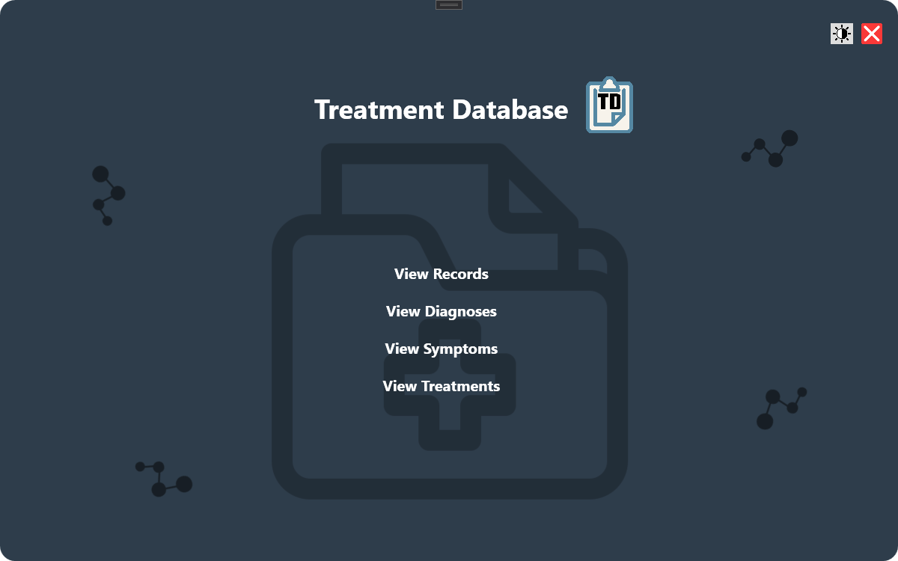
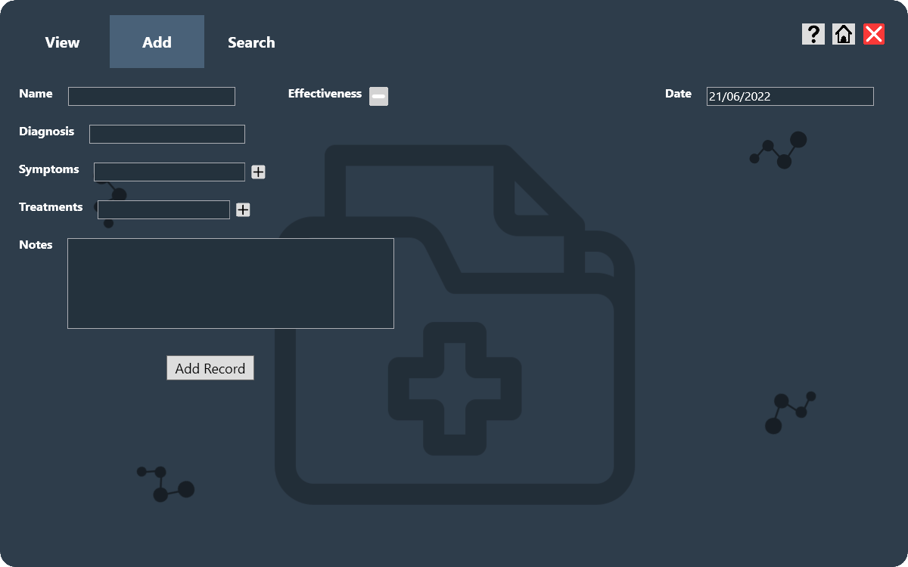

# Treatment Database
A Windows Presentation Foundation (WPF) application to track patient treatments. 

Users can log their treatment records into the application and search for similarities between different treatments. 

The application also analyses the data and highlights patterns based on it.

## Features
- Tracking of treatment records

      
    
    - Each record consists of a `Name`, a `Date`, a `Diagnosis`, up to 6 `Symptoms`, up to 6 `Treatments`, a treatment `Effectiveness` (Ineffective, unsure or effective) and `Notes`   
    

- Searching through the database for specific records using filters
- Analysis on stored data such as the most common diagnosis for a certain symptom, frequency of different diagnoses or common symptoms for certain diagnoses
- 2 different color modes (Light and Dark Mode)

## To try the application:
1. Click on the green `Code` button at the top right of the page, then `Download as ZIP`
2. Extract the downloaded files into a folder
3. Then, run `treatment_database.application`
- There will be a security warning that you will need to agree to install the application (as I did not a purchase a certificate)

After the app is installed, it can be run through the:
- Desktop shortcut
- The Start Menu
- Through `treatment_database.application`  

Any future updates will be automatically detected.

The &nbsp;&nbsp; icon can be clicked to display more information.

## To uninstall the application:
1. Go to `Add or Remove Programs` in your computer settings.
2. Find the application in the list and click `Uninstall`

*Note that any stored data will be deleted and cannot be restored!*

## Credits
Translucent icons used in background UI *(Folder and connected circles)*

Link: <a href="https://www.flaticon.com/free-icons/big-data" title="big data icons">Big data icons created by Freepik - Flaticon</a>
